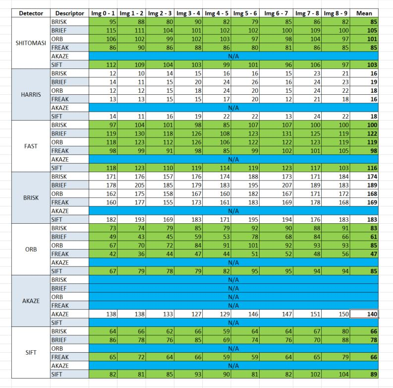
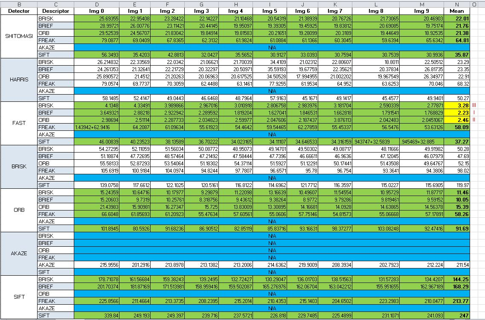

# SFND 2D Feature Tracking

## Code Starter Repository
Please refer to https://github.com/udacity/SFND_2D_Feature_Tracking

## Task MP.1
See MidTermProject_Camera_Student.cpp, lines 66-70.

Simply delete the very first element when the buffer size/threshold is reached. Vector libs have already handled the Shift. Operator '>=' asures a thread safety.

## Task MP.2
See MidTermProject_Camera_Student.cpp, lines 85-93.

See matching2D_Student.cpp, lines 97-244.

See Harris Corner Detection Exercise, and the lecture for NMS.

See Popular Keypoint Detectors Exercise.

We are simply using the OpenCV libs. For the simplicity of this project, multiple default parameters are utilized for creating the detectors. The source code is self-explanatory.

## Task MP.3
See MidTermProject_Camera_Student.cpp, lines 101-112.

The source code is self-explanatory.

Iterating through the key points and erase what are not in the region of interest.

## Task MP.4
See MidTermProject_Camera_Student.cpp, line 142.

See matching2D_Student.cpp, lines 60-64.

The source code is self-explanatory.

Simply using the OpenCV libs with a majorty of default parameters.

## Task MP.5

See MidTermProject_Camera_Student.cpp, lines 155-166.

See matching2D_Student.cpp, lines 7-57.

See Descriptor Matching Exercise and the related lectures.

The source code is self-explanatory.

We are not implementing anything from scratch. Just simply using the OpenCV libs.

## Task MP.6
See matching2D_Student.cpp, lines 47-52.

See Descriptor Matching Exercise and the related lectures.

The source code is self-explanatory.

Just using .8 as a threshold for selecting the matches with the distance ratio less than that. 

## Task MP.7
Please see the below table for the number of keypoints.

Overall, the detectors can be catigorized into 3 groups:

Group 1 includes SHITOMASI & HARRIS wherein the neighborhood density is truly low, and the keypoints are almot not overlapping each other.

Group 2 includes BRISK, ORB, & AKAZE with high to extremely high neighborhood denisity. Also there are multiple overlaps. 

Group 3 includes SIFT & FAST with low to high neighborhood density and low number of overlapped keypoint-areas.

## Task MP.8
Matcher Configuration: Brute Force and KNN Selector with Descriptor Distance Ratio .8

Please see the below table for the number of matches.

## Task MP.9
Please see the below table for the total runtime of Detector-Descriptor pairs. 

According to this table, the top 3 Detector-Descriptor combinations, in descending order, are FAST-BRIEF, FAST-ORB, and then FAST-BRISK. For Collistion Detection Systems, processing time is a critical criterion affecting the selection of such algorithms. Besides, with respect to the other tables of keypoints and matches, the performance of these pairs is also acceptable (about 80% for the first two pairs, and 68% for the last one). 

## Spreadsheet 
Please see ./FM.xlsx for the collected data.
