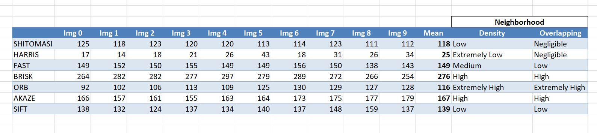

# SFND 2D Feature Tracking

## Code Starter Repository
Please refer to https://github.com/udacity/SFND_2D_Feature_Tracking

## Task MP.7
Please see the below table for the number of keypoints.

Overall, the detectors can be catigorized into 3 groups:
Group 1 includes SHITOMASI & HARRIS wherein the neighborhood density is truly low, and the keypoints are almot not overlapping each other.
Group 2 includes BRISK, ORB, & AKAZE with high to extremely high neighborhood denisity. Also there are multiple overlaps. 
Group 3 includes SIFT & FAST with low to high neighborhood density and low number of overlapped keypoint-areas.

## Task MP.8

## Task MP.7